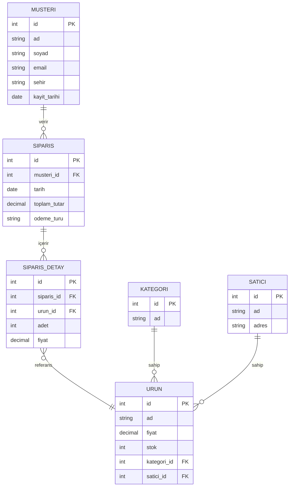

Bu proje, online bir alışveriş platformunda (örneğin Trendyol, n11 gibi) müşteri, ürün, kategori, satıcı ve sipariş verilerini yönetebilen bir veri tabanı tasarlamayı amaçlamaktadır. Başlangıçta sistemde bulunacak varlıklar ve aralarındaki ilişkileri analiz ettim. Bu noktada benden halihazırda istenen şu sonuçları ulaşabildim:
- Bir müşteri birden fazla sipariş verebilir.
-Bir sipariş birden fazla ürün içerebilir.
-Bir ürünün bir kategorisi vardır.
-Bir ürün bir satıcıya aittir.
Bu ilişkileri PRIMARY KEY ve FOREIGN KEY yapılarıyla kurdum.
-------------------------
Karşılaştığım bazı sorunlar ve çözümleri:
1. Oluşturduğum tablolarda veri ekleme çıkarması yaparken verilere atanan D'lerin kaydığını fark ettim. Bu noktada tablomu TRUNCATE edip kimlik değerlerini sıfırladım.
2. Tarih alanı otomatik dolmuyordu DEFAULT GETDATE() komutunun çalışabilmesi için manuel veri ekledim.
3. Birinci yazdığım sorunu fark etmeden önce “FOREIGN KEY  CONSTRAINT CONFLICT” hatası aldım. Ürün eklemeye çalışırken yazdığım ID'lerin tablomda bulunmadığını, nedeninin ise verilerin kaymasından dolayı oluğunu anladım.
-------------------------
Proje sonucunda çalışan bir e-ticaret veri tabanı modeli oluşturulmuştur. Bu sistemde müşteri, ürün, sipariş, satıcı ve kategori ilişkileri doğru şekilde yönetilmekte; stok güncellemeleri ve toplam tutar hesaplamaları yapılmaktadır.
